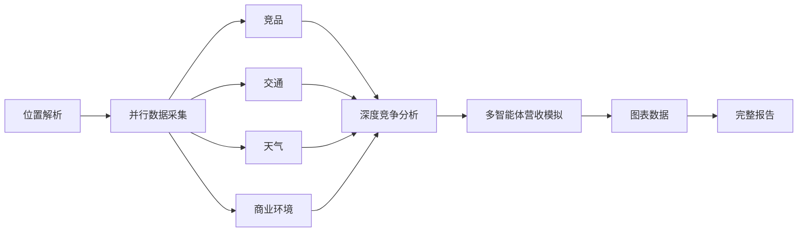

# Restaurant Report Agent 0.0.0

一个可直接运行的餐饮选址与经营分析工作台。后端以 LangGraph 编排高德数据、竞争分析、CompeteAI 启发的多智能体营收情景和 Markdown 报告；前端提供地图选点、参数输入、图表与五个报告页面。

## 已实现能力

- 地址解析、地图选点和精确坐标输入
- 同类门店、地铁/公交/停车、天气和商业环境 POI 分析
- 真实高德 REST 数据优先，按调用粒度自动回退到明确标注的模拟数据
- 规则竞争评分 + 可选 LLM 深度解释
- LLM 只可补充叙述字段，不能覆盖规则分数、样本量和价格证据
- 价格渗透、均衡经营、品质溢价三种多智能体竞争情景
- 日订单、月营收、月利润、盈亏平衡、敏感性与六个月情景投影
- 三个情景均不可行时明确输出“无可执行推荐”，不会把最少亏损包装成推荐
- FastAPI、Next.js 工作台、完整 Markdown 报告和独立维度页面
- DashScope OpenAI-compatible 接口，可调整提供商、模型、超时和重试
- 主模型失败时，可读取本机 Claude 配置并通过 Krill 使用 `gpt-5.6-luna`
- 高德连接复用、TTL 缓存、限次重试、调用并发上限与 API 分析并发/频率治理

> 营收结果是可校准的情景模拟，不是财务预测或承诺。未输入真实 POS、租金、人工和菜单毛利时会采用公开写明的行业假设。

## 工作流



深度竞争分析关闭时，图会从并行数据采集直接进入营收模拟。当前实现借鉴 CompeteAI 的“竞争主体—消费者选择—多轮响应”思想，但没有声称复刻上游研究代码；所有可计算结果由本项目的透明、确定性模型生成，LLM 只负责可选解释。

## 安装

要求 Python 3.10+、Node.js 24+（前端测试使用 Node 原生 TypeScript test runner）。

```powershell
cd D:\workspace\Agent\restaurant-report-agent
python -m pip install -r requirements-dev.txt
cd frontend
npm install
```

复制根目录 `.env.example` 为 `.env`，复制 `frontend/.env.example` 为 `frontend/.env.local`，然后填入自己的密钥。真实密钥文件均被 Git 忽略。

后端关键配置：

```env
DATA_MODE=auto
AMAP_TRANSPORT=rest
AMAP_MAPS_API_KEY=your_amap_web_service_key

LLM_PROVIDER=qwen
QWEN_API_KEY=your_dashscope_key
QWEN_BASE_URL=https://dashscope.aliyuncs.com/compatible-mode/v1
QWEN_MODEL=qwen-plus

ENABLE_KRILL_FALLBACK=true
ALLOWED_ORIGINS=http://localhost:3000,http://127.0.0.1:3000
SAVE_API_REPORTS=false
# 对外部署时设置；纯本机使用可以留空
API_ACCESS_TOKEN=
```

`DATA_MODE` 支持：

- `auto`：优先真实接口，单次调用失败时生成明确标注的模拟数据。
- `real`：真实接口失败即报错，适合严格验收。
- `mock`：完全离线、确定性样本，适合测试和演示。

模型可通过 `LLM_PROVIDER` 在 `qwen`、`openai`、`deepseek`、`siliconflow` 间切换，并用各自的 `*_BASE_URL`、`*_MODEL`、`*_API_KEY` 调整。备用 Krill 配置默认从 `%USERPROFILE%\.claude\settings.json` 读取，也可用 `CLAUDE_SETTINGS_PATH` 指定。

## 启动

双击 `start.bat`，或分别运行：

```powershell
# 终端 1
python -m uvicorn api.main:app --host 127.0.0.1 --port 8000

# 终端 2
cd frontend
npm run dev -- --hostname 127.0.0.1 --port 3000
```

访问：

- 前端：`http://127.0.0.1:3000`
- API 文档：`http://127.0.0.1:8000/docs`
- 健康检查：`http://127.0.0.1:8000/api/health`
- 就绪检查：`http://127.0.0.1:8000/api/ready`；加 `?probe=true` 会执行一次真实地图探测并消耗少量配额

CLI 示例：

```powershell
python main.py --name "示例咖啡" --address "北京市朝阳区建国路88号SOHO现代城" --type "咖啡店" --radius 800 --deep-analysis
```

## API

- `GET /api/health`：配置与服务状态，不返回密钥。
- `GET /api/ready`：配置、最近一次分析与可选真实上游探测。
- `GET /api/geocode?address=...`：地理编码与数据来源说明。
- `GET /api/reverse-geocode?location=经度,纬度`：逆地理编码。
- `POST /api/analyze`：运行完整 LangGraph，并返回报告、图表、原始分析和数据来源。

## 验证

```powershell
# 后端单元与集成测试
ruff check api config graph main.py mcp_client nodes services tests tools
ruff format --check api config graph main.py mcp_client nodes services tests tools
python -m unittest discover -s tests -v

# 前端逻辑测试、静态检查、生产构建和生产依赖安全审计
cd frontend
npm test
npm run lint -- --no-cache
npm run build
npm audit --omit=dev
```

`快速测试.bat` 会依次执行以上检查。浏览器端到端验收覆盖首页分析、地图坐标、完整报告、位置交通、商业环境、天气、竞争营收和设置页。

## 数据边界

- 高德 POI 单页有数量上限，样本不能等同于完整市场普查。
- 配额耗尽、接口超时或产品权限不足时，`auto` 模式会显示具体回退说明。
- 前端不保存高德或 LLM 密钥；若后端启用访问令牌，设置页只把令牌保存在当前标签会话。
- API 默认不将报告写入磁盘；显式启用后采用微秒时间戳与 `run_id` 命名，并按保留期清理。
- 建议用至少四周真实订单、客单、成本和复购数据重新校准营收模型。
